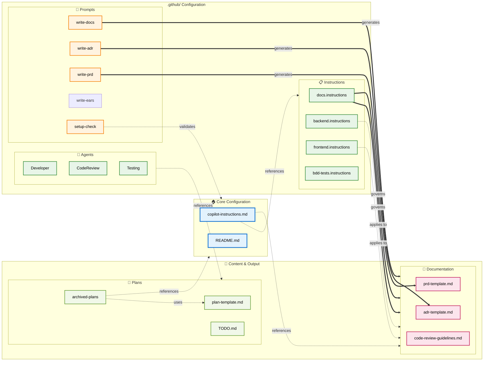

# RPG Manager - Project Entry Point

This file provides a high-level map of the project structure and resources for the AI Agent.

## 🤖 AI Agent Resources
- **[Instructions](.github/instructions.md)**: Central entry point for all coding standards, tech stack details, and sub-instructions (Backend, Frontend, Docs).
- **[Prompts](.github/prompts/)**: Reusable prompt templates for common tasks.

## 🛠️ Environment & Troubleshooting
- **Docker & Testcontainers**: If Testcontainers fail to start, ensure Docker is running.
- **Compatibility**: See **[Testcontainers Compatibility](docs/TESTCONTAINERS_COMPATIBILITY.md)** for known issues with Docker Desktop versions.
- **Action**: If Docker is not running, ask the user to start it before proceeding with tests.

## 🌿 Branching Strategy
- **New Features**: Starting work on a new feature must ALWAYS be done on a new, dedicated branch.
- **Bug Fixes & Separate Tasks**: When starting work on something else (such as simple bug fixes or unrelated tasks), you MUST create and use separate branches. Do not mix unrelated changes in a single branch.

## 🧪 Quality Assurance Workflows
Use these standardized npm scripts (defined in root `package.json`) to verify code quality. They cover both Backend and Frontend.

- **`npm run sonar:quick`**: **Standard Check**. Runs Linting, Unit Tests, and Coverage before scanning. Use this for pre-push verification.
- **`npm run sonar:full`**: **Deep Check**. Runs everything in Quick + **Mutation Testing** (PIT/Stryker). Use this for critical logic verification.
- **`npm run sonar:scan`**: **Upload Only**. Uploads existing reports without re-running tests.

### 🎭 End-to-End (E2E) Testing
Run E2E tests using Playwright (requires the frontend to be buildable):
- **`cd frontend; npm run e2e`**: Runs all E2E tests in headless mode.
- **`cd frontend; npm run e2e:cli`**: Runs E2E tests with list reporter (best for terminal output).
- **`cd frontend; npm run e2e:ui`**: Opens Playwright UI for interactive debugging.

## 📅 Project Management
- **[Plans & TODO](plans/TODO.md)**: Current development roadmap and task tracking.

## 📖 Documentation
- **[Architecture & Requirements](docs/)**: Contains ADRs, PRDs, and technical design documents.
- **[Contributing](CONTRIBUTING.md)**: Project setup and workflow guidelines.

---
*Follow the guidelines defined in `.github/instructions.md` for all development tasks.*

---

# Detailed Repository Context

## 1. Custom Agents

The repository includes specialized agents located in `.github/agents/`:

- **Developer**: Focuses on test-driven development with quality gates and design-first methodology
- **Code Reviewer**: Implements systematic code review with best practices enforcement
- **Tester**: Emphasizes BDD-focused testing approach with comprehensive test coverage

## 2. Reusable Prompt Templates

Located in `.github/prompts/`, these templates provide standardized approaches for:

- **`write-adr.prompt.md`**: Creates Architectural Decision Records with structured templates
- **`write-prd.prompt.md`**: Generates Product Requirements Documents with measurable objectives
- **`write-docs.prompt.md`**: Produces consistent documentation following repository standards
- **`write-ears-spec.prompt.md`**: Creates requirements using Easy Approach to Requirements Syntax
- **`copilot-setup-check.prompt.md`**: Evaluates and optimizes Copilot configuration

## 3. Repository Structure & Templates

The `docs/` directory provides organized templates for:

- **ADRs** (`docs/ADRs/`): Architecture decision documentation with context and consequences
- **PRDs** (`docs/PRDs/`): Product requirements with priorities and acceptance criteria
- **Design Documents** (`docs/design/`): Technical design specifications
- **Engineering Guidelines** (`docs/engineering/`): Development process documentation

## 4. Project Planning Framework

The `plans/` directory includes:

- **Plan Templates**: Structured project planning with stakeholders and timelines
- **Roadmap Management**: Strategic planning and milestone tracking
- **TODO Management**: Task tracking and completion monitoring

## 5. Document Reference Hierarchy

This diagram shows how documents reference each other across the repository, mapping the interconnections between configuration files, instructions, prompts, documentation, and plans.

## 6. Appendix: SSOT Source Map

Authoritative single sources of truth (SSOT) for key policies and templates. Prefer linking to these instead of duplicating content.

- Core policies and workflow
  - Copilot instructions (SSOT): `.github/copilot-instructions.md`
    - Quality & Coverage Policy: `.github/copilot-instructions.md#quality-policy`

### CI Coverage Enforcement

This repo includes a minimal coverage enforcement workflow (`.github/workflows/coverage.yml`) and script (`.github/scripts/enforce-coverage.js`) aligned with the Quality & Coverage Policy:

- All code ≥ 95%; critical/hot/error/security paths 100%.
- Branching & Workflow: see "Project Methodologies" in the same file
- Naming & Commit Conventions: see corresponding sections in the same file

- Engineering guidelines
  - Code review checklist (SSOT): `docs/engineering/code-review-guidelines.md#code-review-checklist`
  - Pull request guidelines: `docs/engineering/pull-request-guidelines.md`
- Documentation
  - Docs authoring rules (SSOT): `.github/instructions/docs.instructions.md`
  - Documentation flow anchor: `.github/instructions/docs.instructions.md#documentation-process-flow`
- Testing
  - **QA Workflows (Standard):** `npm run sonar:quick` / `npm run sonar:full` (see **Quality Assurance Workflows** above)
  - Development Setup & Quality Guide: `docs/engineering/development-setup.md`
  - BDD feature guidance (SSOT): `.github/instructions/bdd-tests.instructions.md`
  - Tester agent (enforces policy): `.github/agents/Tester.agent.md`
- Backend
  - Backend instructions (SSOT): `.github/instructions/backend.instructions.md`
  - Architecture: `.github/instructions/backend.instructions.md#backend-architecture`
  - Error handling: `.github/instructions/backend.instructions.md#backend-error-handling`
  - Observability: `.github/instructions/backend.instructions.md#backend-observability`
  - Security: `.github/instructions/backend.instructions.md#backend-security`
- Planning
  - Plan template (SSOT): `plans/plan-template.md`
  - Small plan example: `plans/examples/plan-small.md`
  - TODO (work queue): `plans/TODO.md`