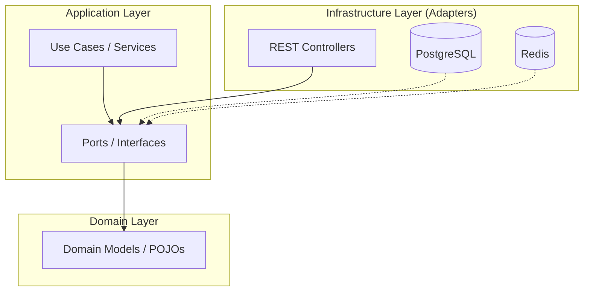

# ⚔️ RPG Manager

[](https://www.oracle.com/java/)
[](https://spring.io/projects/spring-boot)
[](https://angular.io/)
[](#-architecture)
[](LICENSE)

A modern, full-stack application designed for Tabletop RPG (TTRPG) enthusiasts. **RPG Manager** helps Game Masters and players organize campaigns, track sessions, and maintain detailed character sheets with ease.

## ✨ Key Features

- **🏰 Campaign Orchestration:** Create and manage complex TTRPG campaigns.
- **📅 Session Tracking:** Log history, outcomes, and progress of every gaming session.
- **📜 Dynamic Character Sheets:** Detailed stat tracking with support for different character types (Permanent/Temporary).
- **🎭 Role-Based Access:** Distinct workflows for Game Masters (GMs) and Players.
- **⚡ High Performance:** Integrated **Redis** caching for lightning-fast retrieval of frequent data.
- **🛡️ Secure by Design:** JWT-based authentication and role-enforced API endpoints.

## 🏗️ Architecture

The project is built using **Hexagonal Architecture (Ports & Adapters)**, ensuring that core business logic remains independent of frameworks, databases, and external UI.



- **[Deep Dive into Architecture](docs/engineering/hexagonal-architecture.md)**

## 🚀 Tech Stack

### Backend
- **Core:** Java 21, Spring Boot 3.3
- **Security:** Spring Security, JWT
- **Tooling:** MapStruct (Mapping), Instancio (Test Data)
- **Caching:** Redis

### Frontend
- **Core:** Angular 19, TypeScript
- **Styling:** Bootstrap, SCSS

### Quality & DevOps
- **Analysis:** SonarQube
- **Persistence:** PostgreSQL
- **Environment:** Docker Compose
- **Testing:** JUnit 5, Mockito, Testcontainers, Playwright (E2E)

## 🗺️ Project Tracking

- **[Strategic Roadmap](plans/ROADMAP.md):** High-level phases and long-term milestones.
- **[Active TODO Queue](plans/TODO.md):** Current tasks and active development plans.

## 🛠️ Getting Started

### Prerequisites
- [Docker Desktop](https://www.docker.com/products/docker-desktop/)
- [Java 21](https://adoptium.net/temurin/releases/?version=21)
- [Node.js](https://nodejs.org/) (v20+)

### Quick Start
1.  **Clone the repository:**
    ```bash
    git clone https://github.com/your-username/rpg-manager.git
    cd rpg-manager
    ```
2.  **Launch the infrastructure:**
    ```bash
    cd docker
    docker compose up -d
    ```
3.  **Access the Application:**
    - **Frontend:** `http://localhost:4200`
    - **API Docs:** `http://localhost:8080/actuator`
    - **SonarQube Dashboard:** `http://localhost:9000`

---
*Developed and maintained with precision by the AI Agent.*
