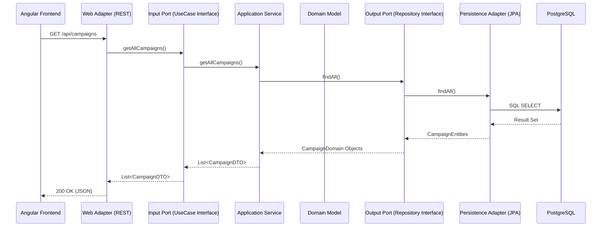

# Architecture Directory

This directory describes the system architecture, focusing on the transition to a decoupled, testable system.

## 🏗️ Core Architecture

The system is built using **Hexagonal Architecture (Ports & Adapters)**. This pattern ensures that business logic is isolated from infrastructure concerns (DB, Web, Caching).

### Interaction Flow

- **[Hexagonal Architecture Details](../engineering/hexagonal-architecture.md):** Deep dive into the pattern, package structure, and rules enforced in this project.

## 📝 Architecture Decision Records

- [Architecture Decision Records (ADRs)](../ADRs/README.md)

<!-- © Capgemini 2025 -->
