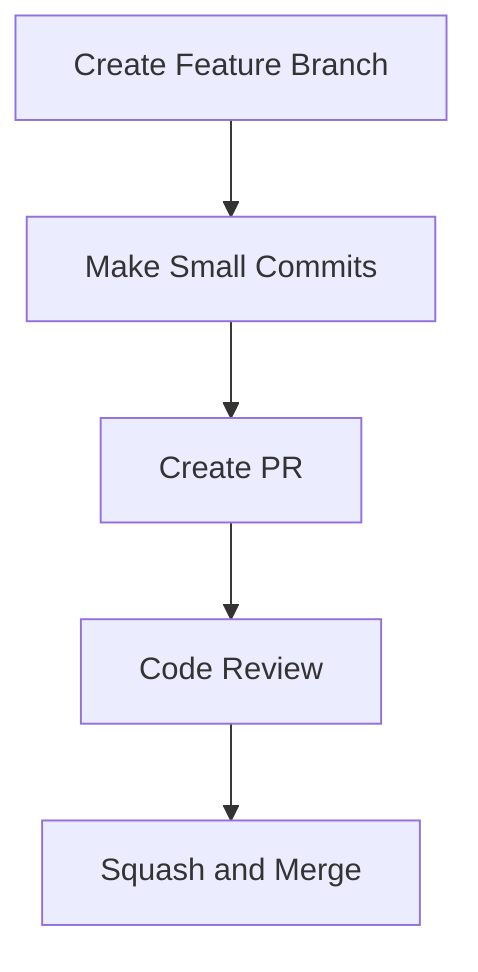

# Enhance GitHub Copilot Instructions - Replace TODO Items

This plan provides a detailed approach to replacing all TODO items in the `copilot-instructions.md` file with comprehensive, unambiguous instructions for AI assistants, using reinforcement techniques including XML blocks, Mermaid diagrams, and precise Markdown formatting.

---

## 1. Title (string, max 120 chars)

Enhance GitHub Copilot Instructions by Replacing TODO Items with Comprehensive AI Assistant Guidelines

## 2. Short description (string, 1-3 sentences, max 500 chars)

Replace all TODO items in `.github/copilot-instructions.md` with detailed, unambiguous instructions for AI assistants. Use reinforcement techniques (XML blocks, Mermaid diagrams, Markdown styling) to ensure AI comprehension and strict compliance with project methodologies and coding standards.

## 3. Current status (object)

```yaml
owner: Stuart Williams <stuart@example.com>
state: proposed
last_updated: 2025-09-15
blockers: []
```

## 4. Objectives (ordered list, 1-10 items)

1. Replace all 8 TODO items in `copilot-instructions.md` with comprehensive, actionable instructions
2. Create unambiguous branching strategy and commit convention guidelines that AI assistants will strictly follow
3. Implement reinforcement techniques (XML blocks, Mermaid diagrams) to ensure AI comprehension
4. Establish clear coding standards section with references to existing project documentation
5. Ensure all instructions are compatible with existing repository structure and AGENTS.md guidance
6. Create measurable acceptance criteria for each instruction section

## 5. Success criteria (list; each item must be measurable and include acceptance criteria)

- name: `TODO Completion`
  metric: `number of TODO items resolved`
  target: `8/8 (100%)`
  verification: `grep search for "TODO" in copilot-instructions.md returns zero results`

- name: `Instruction Clarity`
  metric: `unambiguous instruction sections`
  target: `all sections contain specific, actionable directives`
  verification: `manual review confirms each section has clear "MUST", "MUST NOT", "SHOULD" statements`

- name: `Reinforcement Techniques`
  metric: `use of XML blocks and Mermaid diagrams`
  target: `minimum 3 XML reinforcement blocks and 1 Mermaid diagram`
  verification: `document inspection shows XML tags and valid Mermaid syntax`

- name: `Cross-reference Consistency`
  metric: `references to existing documentation`
  target: `all referenced files exist and are correctly linked`
  verification: `file path verification and link validation`

## 6. Scope (object with two arrays: in, out)

```yaml
in:
- Replace all 8 TODO items in .github/copilot-instructions.md
- Create comprehensive branching strategy guidelines
- Define commit message conventions with XML reinforcement
- Establish PR and code review process instructions
- Create coding standards section with references to existing docs
- Implement Mermaid diagram for branching workflow
- Add XML blocks for critical instruction reinforcement
- Ensure compatibility with existing AGENTS.md and README.md guidance

out:
- Modifying other instruction files in .github/instructions/
- Creating new documentation files outside of copilot-instructions.md
- Changing existing repository structure or file organization
- Modifying settings.json or other configuration files
```

## 7. Stakeholders & Roles (table or list)

- `Stuart Williams — Plan Owner — responsible for plan creation and execution — stuart@example.com`
- `User/Requester — Requirements Owner — responsible for requirements validation and approval — [to be provided]`
- `AI Assistant — Implementation Agent — responsible for code implementation following plan — n/a`

## 8. High-level timeline & milestones (ordered list)

1. `M1 — Plan Approval — 2025-09-15 — Stuart Williams`
2. `M2 — Discovery and Analysis Complete — 2025-09-15 — Stuart Williams`
3. `M3 — Implementation Complete — 2025-09-15 — AI Assistant`
4. `M4 — Review and Validation — 2025-09-15 — User/Requester`

## 9. Task list (hierarchical, actionable tasks with estimates)

### Discovery Tasks

- T-001 | Analyze all 8 TODO items and categorize by type | Stuart Williams | 1h | deps: [] | done: true
- T-002 | Review existing repository documentation for consistency requirements | Stuart Williams | 1h | deps: [T-001] | done: true
- T-003 | Identify reinforcement techniques and examples | Stuart Williams | 0.5h | deps: [T-001] | done: true

### Implementation Tasks

- T-004 | Create branching strategy guidelines with XML reinforcement | AI Assistant | 1h | deps: [T-001,T-002,T-003] | done: false
- T-005 | Define commit message conventions with examples | AI Assistant | 1h | deps: [T-001,T-002,T-003] | done: false
- T-006 | Create PR and code review process instructions | AI Assistant | 1h | deps: [T-001,T-002,T-003] | done: false
- T-007 | Implement Mermaid diagram for branching workflow | AI Assistant | 0.5h | deps: [T-004] | done: false
- T-008 | Create coding standards section with references | AI Assistant | 1h | deps: [T-001,T-002,T-003] | done: false
- T-009 | Add XML reinforcement blocks for critical instructions | AI Assistant | 0.5h | deps: [T-004,T-005,T-006] | done: false
- T-010 | Validate all file references and links | AI Assistant | 0.5h | deps: [T-008] | done: false

### Review Tasks

- T-011 | Conduct comprehensive review of all replacements | User/Requester | 1h | deps: [T-004,T-005,T-006,T-007,T-008,T-009,T-010] | done: false
- T-012 | Validate acceptance criteria | User/Requester | 0.5h | deps: [T-011] | done: false

## 10. Risks and mitigations (table or list)

- R-001: `Ambiguous requirements interpretation` | probability: medium | impact: medium | mitigation: `Request clarification from user for any ambiguous TODO items before implementation` | owner: `Stuart Williams`
- R-002: `Conflicting instructions with existing docs` | probability: low | impact: high | mitigation: `Cross-reference all existing documentation and escalate conflicts to user` | owner: `AI Assistant`
- R-003: `XML or Mermaid syntax errors` | probability: low | impact: low | mitigation: `Validate all syntax before finalizing implementation` | owner: `AI Assistant`

## 11. Assumptions (list)

- User will provide clarification for any ambiguous requirements discovered during analysis
- Existing repository structure and file paths are stable and should not be modified
- The primary audience for these instructions is AI assistants (specifically GitHub Copilot)
- Instructions should follow the repository's existing tone and style established in README.md and AGENTS.md
- All referenced files and paths in the current repository are correct and accessible

## 12. Implementation approach / Technical narrative (detailed, up to 1000-2000 words)

### Overview

The implementation will systematically replace each TODO item with comprehensive, unambiguous instructions designed specifically for AI assistant comprehension. The approach emphasizes clarity, enforceability, and consistency with existing repository guidance.

### TODO Analysis and Categorization

Based on the current `copilot-instructions.md` file, there are 8 distinct TODO items that fall into two main categories:

#### **Category 1: Project Methodologies (7 items)**

1. Branching strategy and development workflow
2. Short-lived branch requirements and PR process
3. Branch and PR naming conventions
4. Commit message conventions
5. Branch and commit process (rebase/squash)
6. XML reinforcement for branch/commit process
7. Mermaid diagram for branch/commit process

#### **Category 2: Coding Standards (1 item)**

1. General coding standards and references to project-specific guidelines

### Implementation Strategy

#### 1. Branching Strategy and Development Workflow

Will implement a comprehensive section defining:

- Trunk-based development principles with specific requirements
- Branch lifecycle management (creation, work, merge, cleanup)
- Integration with existing CI/CD practices
- Enforcement through XML blocks with `<REQUIREMENT>` tags

#### 2. Commit and PR Conventions

Will create detailed specifications for:

- Conventional commit format with specific patterns
- PR naming conventions aligned with branch naming
- Required PR content and review processes
- Automated enforcement guidelines

#### 3. Reinforcement Techniques Implementation

The plan employs three primary reinforcement techniques:

**XML Reinforcement Blocks**: Critical instructions will be wrapped in semantic XML tags:

```xml
<REQUIREMENT type="MANDATORY">
AI assistants MUST create branches using the pattern: feature/brief-description
</REQUIREMENT>
```

**Mermaid Process Diagrams**: Complex workflows will be visualized:



**Markdown Emphasis**: Strategic use of **bold**, _italic_, and `code` formatting to highlight critical instructions.

### Integration with Existing Documentation

The implementation will maintain consistency with:

- `AGENTS.md`: Respecting the hierarchy of instructions and cross-referencing approach
- `README.md`: Following the established best practices and tone
- Existing instruction files: Ensuring no conflicts with backend, frontend, or documentation guidelines
- `settings.json`: Respecting the established VS Code configuration patterns

### Coding Standards Approach

Rather than duplicating standards, the implementation will:

- Reference existing documentation files where they exist
- Create placeholder structure for standards that should be developed later
- Establish clear patterns for AI assistants to follow when standards files are expanded
- Maintain consistency with the repository's educational and template nature

### Validation and Quality Assurance

Each implemented section will include:

- Specific, measurable requirements that can be programmatically verified
- Examples and counter-examples for clarity
- Clear escalation paths for edge cases or conflicts
- Integration points with existing repository tools and processes

### Technical Implementation Details

The implementation will preserve the existing file structure and formatting while:

- Replacing TODO markers with substantive content
- Maintaining proper Markdown hierarchy and formatting
- Ensuring all file references are valid and accessible
- Following the established repository conventions for documentation

## 13. Testing & validation plan

- **Content Validation**: Each TODO replacement will be manually reviewed for completeness and clarity
- **Syntax Validation**: All XML blocks and Mermaid diagrams will be tested for proper syntax
- **Link Validation**: All file references and paths will be verified to exist in the repository
- **Consistency Testing**: Cross-reference check against AGENTS.md, README.md, and instruction files
- **TODO Completion**: Automated grep search to confirm zero remaining TODO items

## 14. Deployment plan & roll-back strategy

- **Environments**: Single file modification in development branch
- **Deployment Steps**:
  1. Create feature branch from main
  2. Implement all TODO replacements
  3. Validate against acceptance criteria
  4. Commit changes with appropriate commit message
  5. Push branch and create PR for review
- **Roll-back Strategy**: Simple git revert of changes if issues are discovered post-merge

## 15. Monitoring & observability

- **Success Metrics**: Completion tracked by TODO count and user acceptance
- **Quality Metrics**: Manual review scores for clarity and completeness
- **Compliance Metrics**: Adherence to existing repository patterns and styles

## 16. Compliance, security & privacy considerations

- **Data Classification**: Documentation content only, no sensitive data involved
- **Repository Standards**: Must maintain consistency with existing Capgemini template repository standards
- **AI Safety**: Instructions must not create opportunities for AI assistants to make unauthorized changes

## 17. Communication plan

- **Milestone Notifications**: Status updates to user/requester at each milestone completion
- **Issue Escalation**: Immediate notification if conflicts or ambiguities are discovered
- **Completion Notification**: Final notification with summary of changes and validation results

## 18. Related documents & links

- Current file: `/Users/stuartwilliams/src/github.com/capgemini/template-github-copilot/.github/copilot-instructions.md`
- Referenced files: `AGENTS.md`, `README.md`, `settings.json`
- Plan template: `/Users/stuartwilliams/src/github.com/capgemini/template-github-copilot/plans/plan-template.md`

## 19. Appendix (examples, data samples, migration mappings)

### Current TODO Items Inventory

1. `TODO branching strategy (prefer lightweight, trunk-based-development, small but numerous commits), commit message conventions, PR review process, CI/CD practices, etc.`
2. `TODO only work in short-lived branches, create PRs for all changes, get at least one approval before merging, etc.`
3. `TODO reinforcement of branch and PR naming conventions, e.g., feature/brief-description, fix/brief-description, docs/brief-description, etc.`
4. `TODO reinforcement of commit message conventions, e.g., use imperative mood, reference issues, etc.`
5. `TODO reinforcement of branch and commit process, e.g., rebase before merging, squash commits, etc.`
6. `TODO reinforcement of branch and commit process, using embedded XML text structures to reinforce instructions to the AI assistant.`
7. `TODO reinforcement of branch and commit process, using Mermaid process diagram to reinforce instructions to the AI assistant.`
8. `TODO general coding standards, linting rules, formatting guidelines, etc.` / `TODO make a reference to project-specific coding standards, linting rules, formatting guidelines, etc. They will be found in docs/engineering/standards.md or similar.`

### Implementation Priority Matrix

**High Priority (Core Functionality)**:

- Branching strategy and workflow
- Commit conventions
- PR process

**Medium Priority (Enhancement)**:

- XML reinforcement blocks
- Mermaid diagrams
- Coding standards references

**Low Priority (Validation)**:

- Cross-reference validation
- Documentation consistency checks

---

**Checklist before marking plan as ready for review:**

- [x] All minimal required fields are filled
- [x] Dates validated (ISO 8601)
- [x] Estimates present and normalized to hours
- [x] At least one test/validation approach is defined
- [x] Security & compliance items are noted

<!-- © Capgemini 2025 -->
